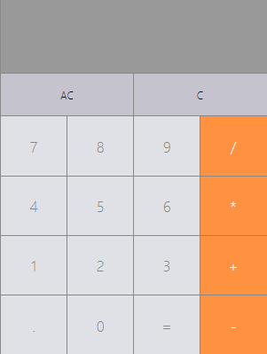

<p align="center"></p>

<a href="https://practical-hamilton-c22290.netlify.app/"><h2>Link to the site</h2></a>

### Getting Started :computer:

```sh
git clone https://github.com/muNeves3/React-Calculator
```

## Install :package:

```sh
yarn install
```

## Usage :rocket:

```sh
yarn run start
```

## Run tests :rocket:

```sh
yarn run test
```
